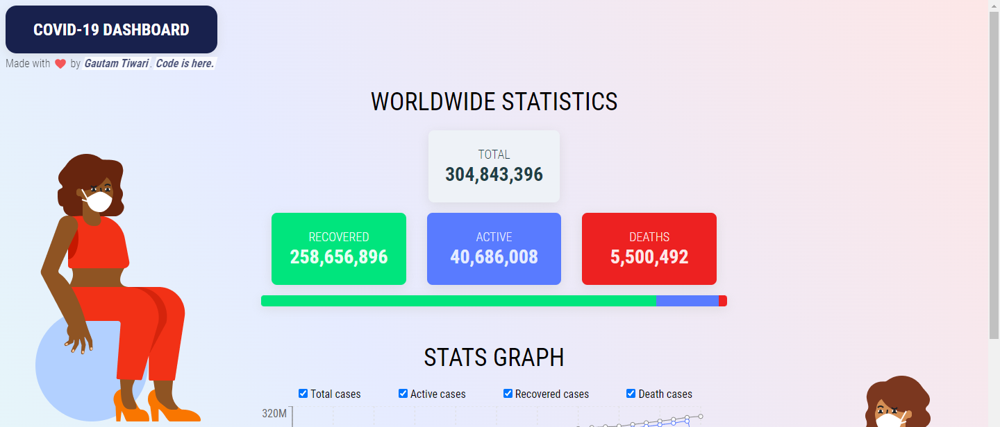
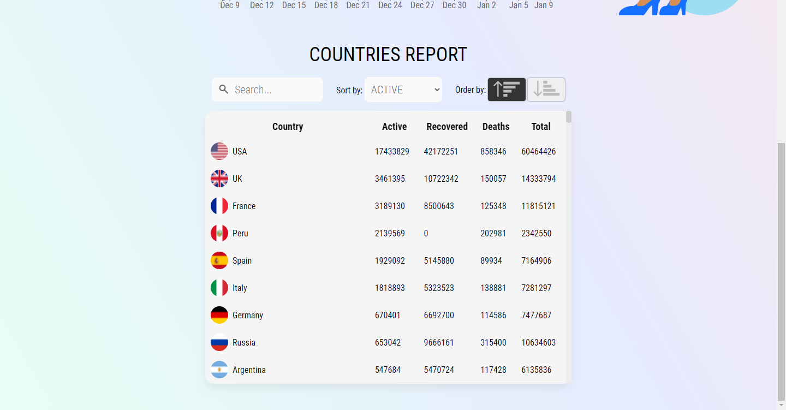

# Covid-19 Dashboard Using React

### Check covid data: https://covid-dashboard-gautam.netlify.app/

The assignment/project/website does the following things:

1. Collects worldwide and country-wise data
2. Plots a graph for worldwide data
3. Displays a table for countries report.

### API used: https://covid-19-apis.postman.com/

### Libraries used: Recharts (for plotting line graph)

### Screenshots:

